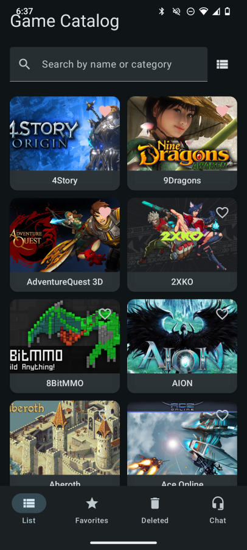
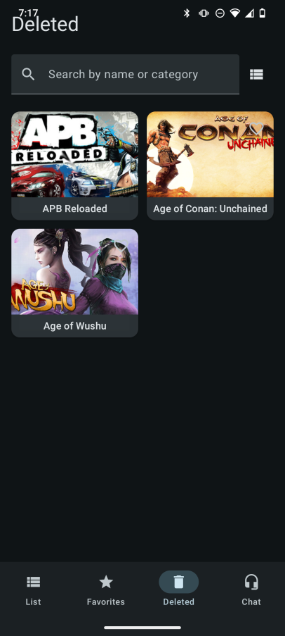
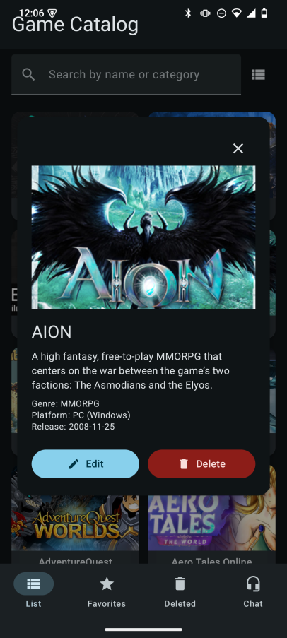
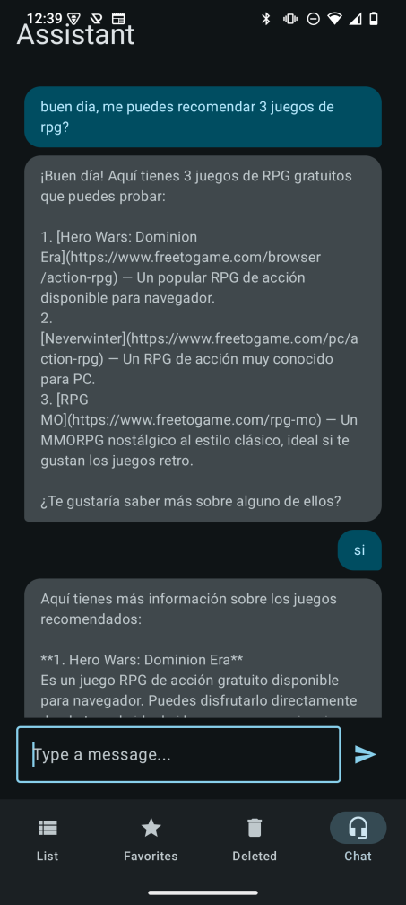
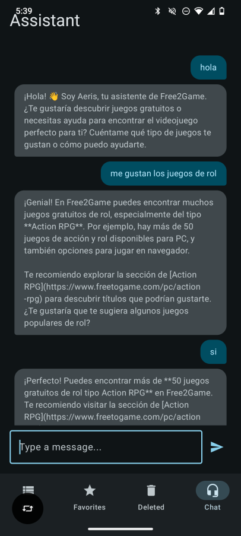
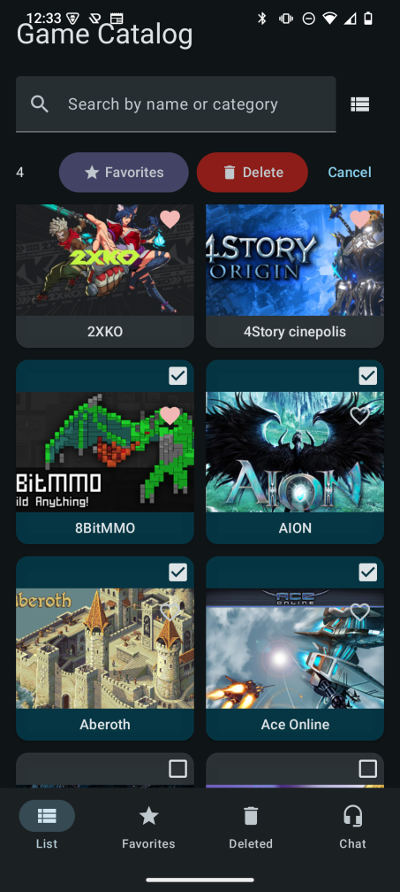
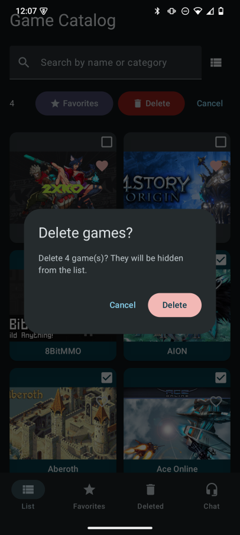

# Catálogo de videojuegos Cinepolis

Aplicación Android para consultar un catálogo de videojuegos gratuitos, gestionar favoritos y obtener ayuda mediante un asistente de chat integrado.

**[English version](README.md)**

---

## Funcionalidades (resumen)

- **Catálogo de juegos** — Explora la lista completa con portada, título, género y descripción breve. Desliza para actualizar y sincronizar los datos.
- **Búsqueda** — Busca por nombre o categoría desde la lista principal, favoritos o eliminados.
- **Vista lista y cuadrícula** — Cambia entre lista y cuadrícula; la app recuerda tu preferencia.
- **Favoritos** — Marca juegos como favoritos y abre la pestaña Favoritos para ver solo esos juegos.
- **Eliminados (papelera)** — Oculta juegos sin borrarlos de forma definitiva. Aparecen en la pestaña Eliminados y se pueden restaurar.
- **Detalle del juego** — Abre cualquier juego para ver la descripción completa, abrir el enlace, actualizar el juego o marcarlo como eliminado.
- **Asistente de chat** — Usa la pestaña Asistente para chatear con un bot basado en Botpress para soporte o consultas.

Capturas de la aplicación:

| Vista lista | Vista cuadrícula | Pantalla de inicio |
|-------------|------------------|-------------------|
|  |  |  |

| Sección favoritos | Sección eliminados | Vista detalle |
|-------------------|--------------------|---------------|
|  |  |  |

| Asistente | Asistente (chat) | Multiselección | Función eliminar |
|------------|------------------|----------------|------------------|
|  |  |  |  |

---

## Arquitectura y stack técnico

### Arquitectura

La app sigue una arquitectura en capas con separación clara de responsabilidades:

- **UI** — Pantallas y ViewModels con Jetpack Compose (MVVM). Navegación con una sola actividad y rutas tipadas.
- **Dominio** — Casos de uso y modelos de dominio; sin dependencias de frameworks.
- **Datos** — Repositorios, base local (Room), APIs remotas (Retrofit), preferencias con DataStore y DTOs/mapeos.

Flujo de datos: UI → ViewModel → Caso de uso → Repositorio → API / BD. La inyección de dependencias se hace con Hilt.

### Stack técnico

| Capa        | Tecnologías |
|-------------|-------------|
| Lenguaje    | Kotlin 2.x |
| UI         | Jetpack Compose, Material 3 |
| DI         | Hilt |
| Asíncrono  | Kotlin Coroutines, Flow |
| BD local   | Room |
| Red        | Retrofit, OkHttp, Gson |
| Preferencias | DataStore (Preferences) |
| Imágenes   | Coil |
| Chat       | API Botpress (REST + SSE) |
| Build      | Gradle (Kotlin DSL), KSP, JaCoCo |

---

## Testing

El proyecto incluye pruebas unitarias para ViewModels, casos de uso, repositorios, mapeos y preferencias. La cobertura se mide con **JaCoCo**.

- **Informe (HTML):** [Informe de cobertura de pruebas unitarias](docs/unit-testing-report/html/index.html)
- **Ubicación del informe:** `docs/unit-testing-report/` (informe HTML en `html/`, XML en la raíz del proyecto cuando se genera)

Captura del informe de cobertura:


Para generar el informe en local:

```bash
./gradlew clean testDebugUnitTest jacocoUnitTestReport
```

El informe HTML se escribe en el directorio configurado (por ejemplo `build/reports/jacoco/` o tu `docs/unit-testing-report/html/` si lo copias o configuras ahí).
