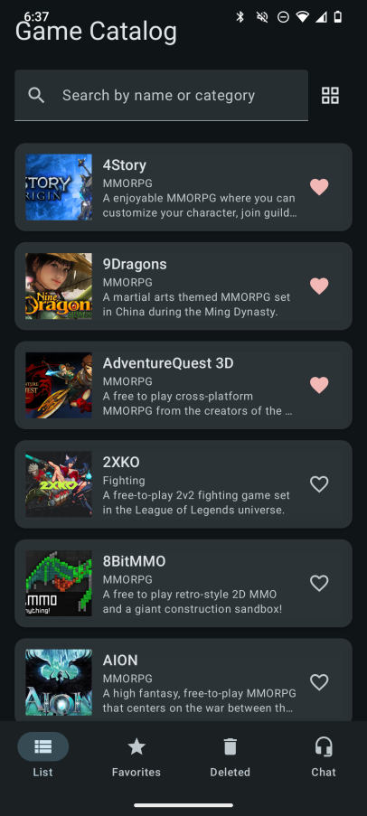
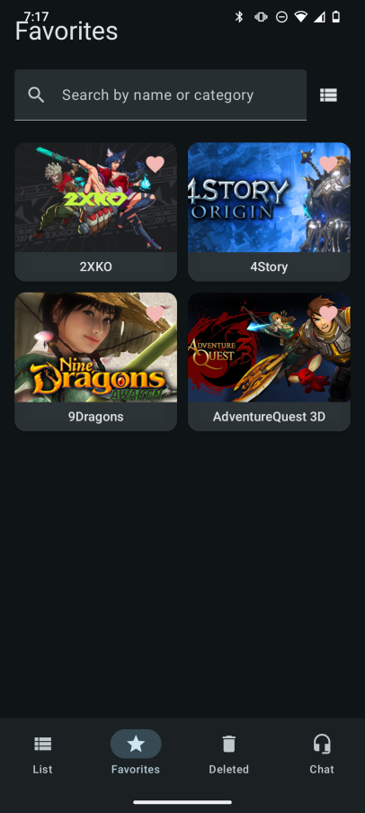
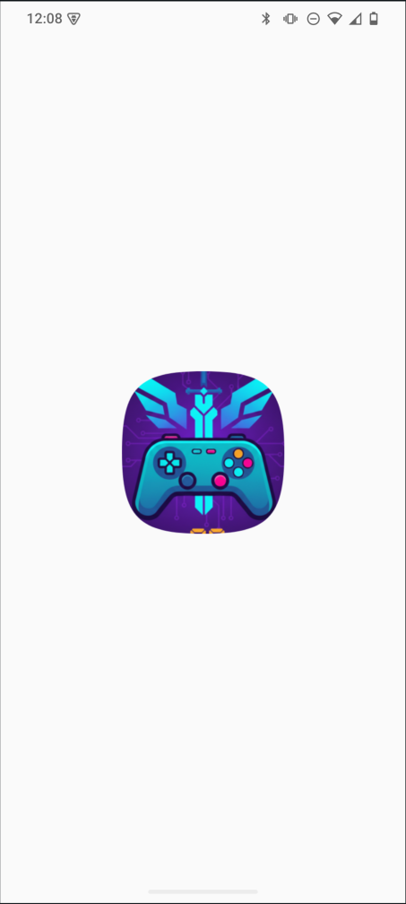
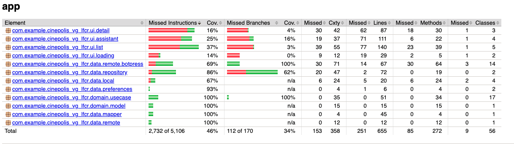

# Cinepolis Video Game Catalog

A modern Android app to browse a catalog of free-to-play video games, manage favorites, and get help via an in-app chat assistant.

**[Versión en español](README.es.md)**

---

## Features (overview)

- **Game catalog** — Browse the full list of games with cover art, title, genre, and short description. Pull to refresh to sync the latest data.
- **Search** — Search games by name or category from the main list, favorites, or deleted list.
- **List and grid view** — Switch between list and grid layout; your choice is remembered.
- **Favorites** — Mark games as favorites and open a dedicated Favorites tab to see only those games.
- **Deleted (trash)** — Soft-delete games you want to hide without losing them. They appear in the Deleted tab and can be restored.
- **Game detail** — Open any game to see full description, open the game link, update the game, or mark it as deleted.
- **Chat assistant** — Use the Assistant tab to chat with a Botpress-powered bot for support or questions.

Screenshots from the app:

| Game catalog (list) | Game catalog (grid) | Search |
|---------------------|---------------------|--------|
|  |  |  |

| Favorites / Deleted | Game detail | Chat assistant |
|---------------------|-------------|----------------|
|  |  |  |

| Loading | Assistant chat |
|---------|-----------------|
|  |  |

---

## Architecture and tech stack

### Architecture

The app follows a layered architecture with clear separation of concerns:

- **UI** — Jetpack Compose screens and ViewModels (MVVM). Single-activity navigation with type-safe routes.
- **Domain** — Use cases and domain models; no framework dependencies.
- **Data** — Repositories, local DB (Room), remote APIs (Retrofit), DataStore preferences, and DTOs/mappers.

Data flow: UI → ViewModel → Use case → Repository → API / DB. Dependency injection is done with Hilt.

### Tech stack

| Layer      | Technologies |
|-----------|----------------|
| Language  | Kotlin 2.x |
| UI        | Jetpack Compose, Material 3 |
| DI        | Hilt |
| Async     | Kotlin Coroutines, Flow |
| Local DB  | Room |
| Network   | Retrofit, OkHttp, Gson |
| Preferences | DataStore (Preferences) |
| Images    | Coil |
| Chat      | Botpress API (REST + SSE) |
| Build     | Gradle (Kotlin DSL), KSP, JaCoCo |

---

## Testing

The project includes unit tests for ViewModels, use cases, repositories, mappers, and preferences. Coverage is measured with **JaCoCo**.

- **Report (HTML):** [Unit test coverage report](docs/unit-testing-report/html/index.html)
- **Report location:** `docs/unit-testing-report/` (HTML report in `html/`, XML in project root when generated)

Coverage report screenshot:



*(Add a screenshot of the JaCoCo report as `docs/unit-testing-report/coverage-report.png` to display it here.)*

To generate the report locally:

```bash
./gradlew clean testDebugUnitTest jacocoUnitTestReport
```

The HTML report is written to the configured output directory (e.g. `build/reports/jacoco/` or your custom `docs/unit-testing-report/html/` if you copy or configure it there).
